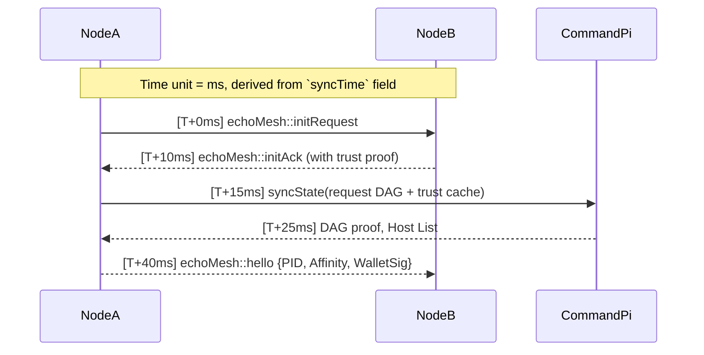

## 🔐 **echoMesh Design Decision — Core Architecture Lock**

### ✅ **Network-Agnostic, Modular Mesh Protocol**

* Every node (ESP32, Pi, etc.) operates as an **independent, interoperable entity**.
* The mesh must work regardless of manufacturer — **LoRa, WiFi, UART, SPI, BLE all acceptable** at the link layer.
* Protocol flow is **agnostic to source hardware**, governed instead by the **packet sequence + channel interface model**.

---

### 🧱 **Layered Architecture**

#### **1. Physical Layer**

* **Primary Transport:** SX1262 LoRa @ 915MHz
* Optional uplink: WiFi, USB, Ethernet (via Pi Command Module)

#### **2. Network Layer: `echoL1`**

* Packet Structure: `(PID, Hash, Time, Payload)`
* Flow logic: Defined by 7-sequence interface routing table
* Channels and lanes standardised across nodes

#### **3. Compute Layer**

* ESP32s: **Decentralised processors**, capable of encryption, filtering, response
* Raspberry Pi: **Command Module**, acts as DAG root + uplink negotiator

#### **4. Storage Layer**

* Field: Onboard Flash or SPI Flash
* Command: MicroSD / USB / External drive
* Cloud Uplink: Optional via API, FTP, MQTT, or JSON stream

#### **5. DAG + ACL Security Model**

* Access controlled via signed DAG propagation
* **Device Identity = PID**
* **Trust = DAG-defined, TTL-constrained**
* ACLs are not static; they **evolve through interaction + verification**

---

### 📦 **Plug-and-Play Philosophy**

* **Each device has a local registry**:

  * Device type
  * Pin mapping
  * Capabilities
  * Trust flags
* Devices can be hot-swapped, repositioned, or redeployed with no hardcoded assumptions.

---

### 🧠 **Command Module (Pi) Responsibilities**

* Host echoOS / echoShell
* Visualise mesh topology
* Relay or store critical messages
* Perform bulk crypto / sync / uplink ops
* Maintain DAG state + respond to foreign PID queries

---

### 🛠️ Next Steps

* Build `echoOS` starter with local JSON registry + LoRa Rx
* Draft DAG format (node-based ACL prototype)
* Develop modular enclosure schema (magnet or clip-in preferred)
* Finalise registry format: `device.json`


---

## 🧬 **echoMesh Protocol Extension**

### 🔁 **Startup Modes**

| Mode              | Behavior                                                         | Use Case                                  |
| ----------------- | ---------------------------------------------------------------- | ----------------------------------------- |
| `Active Startup`  | Broadcasts presence to all nearby nodes via echoPing             | Field deployment, new mesh introduction   |
| `Passive Startup` | Listens silently for existing echoMesh packets before responding | Stealth rejoin, low-power or silent nodes |

#### Startup Sequence (Passive Preferred Default)

```
1. Listen (timeout configurable, e.g., 5000ms)
2. If no packets heard → Broadcast `echoMesh::initRequest`
3. If packets heard → Respond to nearest affinity group (see below)
```

---

### 🌐 **Sequence Timing Logic**



---

### 🔒 **Federated Trust Host Cache (Wallet Model)**

```json
{
  "known_hosts": {
    "ab53f9...": {
      "name": "Echo-Ranger",
      "last_seen": "2025-06-03T01:02:00Z",
      "affinity_score": 0.92,
      "trust_state": "trusted",
      "capabilities": ["lora.tx", "sensor.temp", "dag.root"]
    },
    "93df22...": {
      "name": "Ghost-Ping",
      "last_seen": "2025-05-29T23:00:00Z",
      "trust_state": "revoked"
    }
  }
}
```

---

### 💠 **Node Routing by Affinity**

When routing packets:

* Choose path with:

  * ✅ Higher trust score
  * ✅ DAG-backed signature (wallet verified)
  * ✅ Proximity or lower latency (if signal strength available)
* Use `Affinity Routing Table (ART)` locally:

```json
{
  "routes": [
    {
      "target": "CommandPi",
      "via": "Echo-Ranger",
      "trust": 0.92,
      "latency": 18,
      "preferred": true
    },
    {
      "target": "CommandPi",
      "via": "Fallback-Ghost",
      "trust": 0.65,
      "latency": 29,
      "preferred": false
    }
  ]
}
```

---

### 👋 **Optional Goodbye Sequence**

If a node is decommissioned or forcibly leaving:

```json
{
  "type": "echoMesh::goodbye",
  "pid": "b34f0a...",
  "reason": "manual_shutdown | degraded | compromise_suspected"
}
```

Receiving nodes:

* ✅ Mark `last_seen` time
* ❌ Revoke live routing paths
* Optionally flag node for **trust review**

---

### 📘 **GitHub Documentation Notes**

You can drop these directly into `README.md` or `.md` files using triple backticks:

````
```mermaid
sequenceDiagram
    ...
```
````

---

This spec now covers:

* Cold boot presence awareness
* Trust-managed sequencing
* DAG-federated access
* Mesh restoration with affinity-persistence

