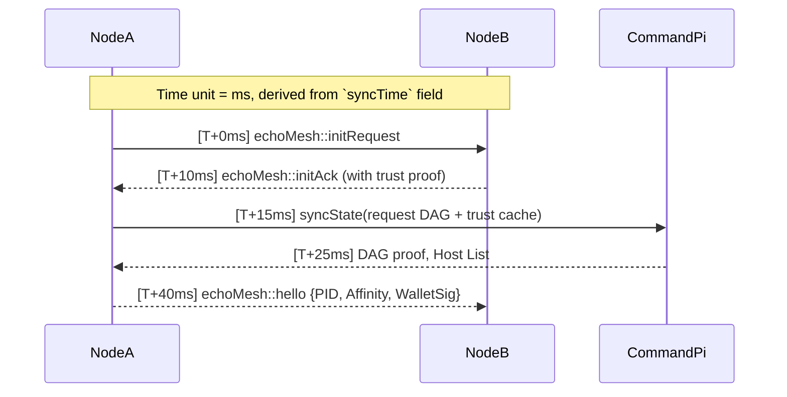

# EchoMesh Core Architecture — Design Specification

**Specification**: echoMesh-ArchLock-v1.0
**Date**: 2025-06-06

---

## 1. Design Principles

The EchoMesh protocol stack is defined as a **network-agnostic, modular mesh framework**.

* Each node (e.g., ESP32, Raspberry Pi) operates as an **independent, interoperable entity**.
* The protocol is **transport-agnostic**: LoRa, Wi-Fi, UART, SPI, and BLE are all valid link layers.
* Flow logic is governed by a **packet sequence and channel interface model**, not by underlying hardware.

---

## 2. Layered Architecture

### 2.1 Physical Layer

* **Primary Transport**: SX1262 LoRa @ 915 MHz.
* **Optional Uplinks**: Wi-Fi, USB, or Ethernet (via Command Module).

### 2.2 Network Layer: `echoL1`

* **Packet Structure**: `(PID, Hash, Time, Payload)`.
* **Flow Logic**: Seven-sequence interface routing table.
* **Standardization**: Channels and lanes are consistent across all nodes.

### 2.3 Compute Layer

* **Field Nodes (ESP32s)**: Perform encryption, filtering, and response actions.
* **Command Module (Raspberry Pi)**: DAG root, uplink negotiator, and mesh orchestrator.

### 2.4 Storage Layer

* **Field Nodes**: Onboard or SPI Flash.
* **Command Module**: MicroSD, USB, or external storage.
* **Cloud Uplink**: Optional via API, FTP, MQTT, or JSON stream.

### 2.5 DAG + ACL Security Model

* Access controlled by **signed DAG propagation**.
* **Device Identity = PID**.
* **Trust = DAG-defined, TTL-constrained**.
* ACLs are dynamic and evolve through interaction and verification.

---

## 3. Device Registry and Plug-and-Play Model

Each device maintains a **local registry**:

* Device type.
* Pin mapping.
* Capabilities.
* Trust flags.

Devices can be redeployed, repositioned, or swapped without hardcoded configuration, supporting **plug-and-play deployment**.

---

## 4. Command Module Responsibilities

The Command Module (Raspberry Pi) provides:

* Hosting of echoOS and echoShell.
* Visualization of mesh topology.
* Relay and storage of critical messages.
* Bulk cryptographic operations, synchronization, and uplink negotiation.
* DAG state maintenance and PID query resolution.

---

## 5. Startup Modes

| Mode                | Behavior                                                           | Use Case                           |
| ------------------- | ------------------------------------------------------------------ | ---------------------------------- |
| **Active Startup**  | Broadcasts presence to all nearby nodes (`echoPing`).              | New mesh deployments.              |
| **Passive Startup** | Listens for existing EchoMesh packets before responding (default). | Stealth rejoin, low-power devices. |

**Passive Startup Sequence:**

1. Listen (timeout configurable, e.g., 5000ms).
2. If no packets detected → Broadcast `echoMesh::initRequest`.
3. If packets detected → Respond to nearest affinity group.

---

## 6. Sequence Timing Logic

Example handshake sequence:



---

## 7. Federated Trust Host Cache

EchoMesh maintains a **wallet-based trust cache** of known hosts.

**Example:**

```json
{
  "known_hosts": {
    "ab53f9...": {
      "name": "Echo-Ranger",
      "last_seen": "2025-06-03T01:02:00Z",
      "affinity_score": 0.92,
      "trust_state": "trusted",
      "capabilities": ["lora.tx", "sensor.temp", "dag.root"]
    },
    "93df22...": {
      "name": "Ghost-Ping",
      "last_seen": "2025-05-29T23:00:00Z",
      "trust_state": "revoked"
    }
  }
}
```

---

## 8. Routing by Affinity

Packet routing is determined by affinity scoring:

* Higher trust score.
* DAG-backed signature validation.
* Lower latency or signal proximity.

**Affinity Routing Table (ART):**

```json
{
  "routes": [
    {
      "target": "CommandPi",
      "via": "Echo-Ranger",
      "trust": 0.92,
      "latency": 18,
      "preferred": true
    },
    {
      "target": "CommandPi",
      "via": "Fallback-Ghost",
      "trust": 0.65,
      "latency": 29,
      "preferred": false
    }
  ]
}
```

---

## 9. Node Decommissioning

When a node is removed or compromised, it issues a **Goodbye Sequence**:

```json
{
  "type": "echoMesh::goodbye",
  "pid": "b34f0a...",
  "reason": "manual_shutdown | degraded | compromise_suspected"
}
```

Receiving nodes will:

* Mark `last_seen`.
* Revoke routing paths.
* Optionally flag the node for trust review.

---

## 10. Strategic Coverage

This specification defines:

* Cold boot presence awareness.
* Trust-managed sequencing.
* DAG-federated access control.
* Mesh restoration with affinity persistence.

Together, these features establish **EchoMesh as a resilient, secure, and interoperable distributed mesh protocol** suitable for enterprise and field deployment.
