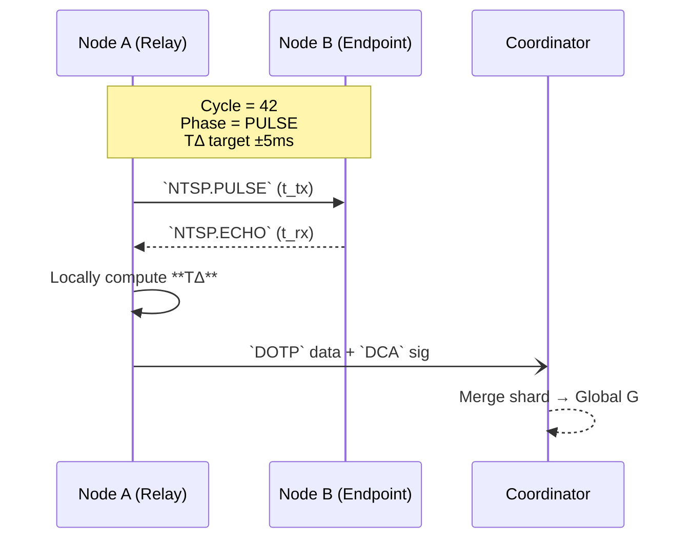

# EchoMesh – Stack Overview  
*A hardware-to-cognition run-down of every tier in the mesh.*

---

## 1. Layer-Cake at a Glance

```mermaid
flowchart TD
    UI[🖥️ User / Ops UI]:::ui
    AI[🧠 FoEC\n Cognition]:::ai
    CTRL[🗄️ Coordinator]:::ctrl
    LOGIC[[Protocol Layer]]:::proto
    LINK[(LoRa PHY\n(868/915))]:::link
    HW[[ESP32-Sx\nHW Abstraction]]:::hw

    UI --> AI
    AI --> CTRL
    CTRL --> LOGIC
    LOGIC --> LINK
    LINK --> HW

    classDef ui fill:#fef6e4,stroke:#333,stroke-width:1px;
    classDef ai fill:#c6f6d5,stroke:#333,stroke-width:1px;
    classDef ctrl fill:#faf089,stroke:#333,stroke-width:1px;
    classDef proto fill:#bee3f8,stroke:#333,stroke-width:1px;
    classDef link fill:#fed7e2,stroke:#333,stroke-width:1px;
    classDef hw fill:#e2e8f0,stroke:#333,stroke-width:1px;
````

| Layer          | Purpose                                               | Key Modules                         |
| -------------- | ----------------------------------------------------- | ----------------------------------- |
| UI / Ops       | CLI, dashboard, OTA config                            | Grafana panel, mesh-cli, OTAd       |
| FoEC Cognition | Pattern vetting (NV1 → NV2 → PV), adaptive heuristics | foec-core, foec-vet                 |
| Coordinator    | Global graph merge, cert signing, role delegation     | controllerd, graph-merge            |
| Protocol       | Mesh wire formats & state machines                    | NTSP, DOTP, DCA-G, DRAP, DMCP, SEMP |
| Link           | Raw RF framing, FHSS, CRC16                           | lora\_driver, IRQ ISR               |
| Hardware       | ESP32-S3, peripheral init, NVS                        | HAL, SPI, GPIO •                    |

---

## 2. Protocol Placement Matrix

```mermaid
graph LR
    subgraph Transport
        NTSP[NTSP<br/>Time Sync]
        DOTP[DOTP<br/>Obj Xfer]
    end
    subgraph Trust
        DCA[DCA-G<br/>Graph CA]
        DRAP[DRAP<br/>Provenance]
    end
    subgraph Config
        DMCP[DMCP<br/>Mesh Config]
        SEMP[SEMP<br/>Presence]
    end
    subgraph Cognition
        FoECV[FoEC-Vet<br/>Reaction Depth]
    end

    NTSP --> DOTP
    DCA --> DOTP
    DRAP --> DOTP
    DMCP --> DOTP
    SEMP --> DMCP
    DOTP --> FoECV
```

| Protocol | Layer     | Brief                                             |
| -------- | --------- | ------------------------------------------------- |
| NTSP     | Transport | Tick/Pulse-Echo sync, TΔ calc (±5ms target drift) |
| DOTP     | Transport | Chunked payload, CRC, multipath echo              |
| DCA-G    | Trust     | Role-scoped certs, key rotation                   |
| DRAP     | Trust     | DAG hash lineage ↔ payload IDs                    |
| DMCP     | Config    | Role negotiation, quorum, channel hopping         |
| SEMP     | Config    | Heartbeat, liveness, presence gossip              |
| FoEC-Vet | Cognition | NV1+NV2+PV vetting & threat depth                 |

---

## 3. Typical Message Lifeline



---

## 4. Data-Structure Snippets

### 4.1 NTSP Packet (CBOR)

```json
{
  "cycle":     42,
  "phase":     0,          // 0=PULSE,1=ECHO,2=HOLD,3=MERGE
  "t_tx_ms":   1718123123,
  "t_rx_ms":   1718123129,
  "crc16":     0x9a3b
}
```

### 4.2 Cert Profile (YAML)

```yaml
pub:   /cert/node_pub.pem
pri:   /cert/node_pri.pem
role:  Relay
scope: Local
ts_issued: 1718123000
expires_in: 604800   # 7 days
grp:
  - echo-alpha
  - mesh-id-0234
```

---

## 5. Graph-Merge Pseudo

```python
def merge_shard(shard, global_g):
    for n, d in shard.nodes(data=True):
        global_g.add_node(n, **d)
    for u, v, w in shard.edges(data=True):
        global_g.add_edge(u, v, **w)
    # Apply node/edge overrides if conflicts exist
    return global_g
```

---

## 6. Hardware Reference

| Pin    | ESP32-S3 | LoRa SX127x | Note        |
| ------ | -------- | ----------- | ----------- |
| GPIO5  | MOSI     | DI0         | SPI MOSI    |
| GPIO18 | MISO     | —           | SPI MISO    |
| GPIO19 | SCK      | —           | Clock       |
| GPIO23 | CS       | NSS         | Chip-select |
| GPIO26 | DIO0     | IRQ         | RX done IRQ |

---

