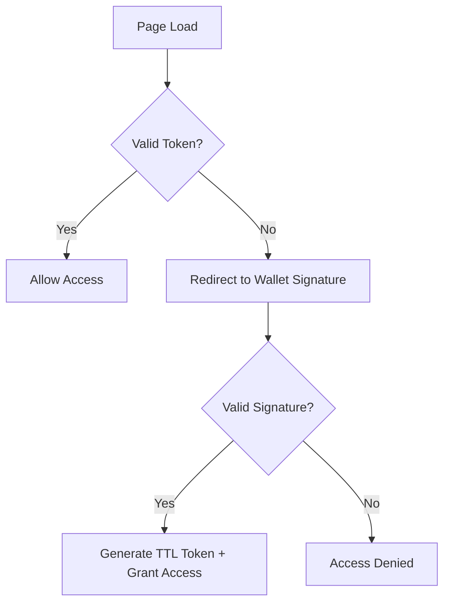

# Appendix: ActiveTrust – The EchoMesh Trust Framework

## Executive Summary

ActiveTrust is a next-generation trust framework designed to enable **secure, consent-driven access** in dynamic digital environments. Unlike traditional access models that rely on static roles and profiles, ActiveTrust emphasizes **presence, intent, and contextual alignment**.

It provides organizations with a verifiable, lightweight protocol that integrates seamlessly with existing enterprise identity and access management systems (IAM), while introducing **self-sovereign consent** and **emergent trust pathways**.

---

## What is ActiveTrust?

ActiveTrust is a self-sovereign protocol that enables:

* **Signing Intent**: Securely binding user intent to actions.
* **Verifying Consent**: Cryptographic proof of consent in real time.
* **Enabling Access**: Contextualized permissions based on dynamic trust, not rigid hierarchies.

Where conventional systems ask *“Who are you?”*, ActiveTrust asks *“How are you showing up in this interaction?”*

---

## Core Principles

| Principle                  | Enterprise Value                                                                 |
| -------------------------- | -------------------------------------------------------------------------------- |
| **Sovereignty First**      | Users maintain ownership of their access decisions, improving transparency.      |
| **Proof over Profile**     | Trust is verified through cryptographic evidence, reducing identity fraud risk.  |
| **Coherence over Control** | Access emerges through contextual alignment, enhancing agility and adaptability. |

---

## Protocol Flow

---

## Trust Stack Integration

ActiveTrust operates within the **EchoMesh / Dust5D architecture** and integrates with enterprise IAM layers:

1. **Dust5D – Temporal Graph Inference**

   * Anchors trust in time-aware graph structures, enabling historical traceability.

2. **Banano Wallet MFA**

   * Wallet signatures act as multi-factor presence proofs.
   * Signed messages = consent handshake.
   * Transactions = verifiable trust expressions.

3. **Dynamic Identity Graphs**

   * Roles emerge from behavioral patterns, peer validation, and contextual alignment.

4. **Relational Trust Fabric**

   * Interactions are recorded as cryptographically signed graph edges, forming a **living trust lattice**.

---

## Enterprise Use Cases

* Secure co-signing of collaborative sessions.
* Consent-based access to files and resources.
* Revocable trust paths with time-to-live (TTL) constraints.
* Dynamic permissions based on graph interaction patterns.
* Compliance-ready consent trails for audit and governance.

---

## Trust Models

| Model                      | Premise                       | Mechanism                    | Outcome            |
| -------------------------- | ----------------------------- | ---------------------------- | ------------------ |
| **Traditional Allow/Deny** | Authority grants access       | Static policy enforcement    | Binary outcome     |
| **Co-Sign/Bounce**         | Access emerges from alignment | Mutual cryptographic consent | Contextual outcome |

---

## Enterprise Integration Pathways

ActiveTrust bridges into existing corporate access and identity frameworks:

* Integration with Azure AD, Okta, IAM platforms via wallet relay hooks.
* Overlay on RBAC/ABAC with **contextual ACLs**.
* Consent-signed session logging for audit trails.
* AccessGraph™ modules for **visual verification and compliance reporting**.

---

## Roadmap

* Wallet co-sign user interface.
* Ribbon-based TTL tracing within Dust5D.
* Consent-signed digital assets with embedded metadata.
* Full AccessGraph visualization module for enterprise governance.

---

## Closing Statement

ActiveTrust reframes digital trust from static enforcement to **dynamic agreement**. By aligning presence, consent, and access, enterprises can achieve a **more resilient, adaptable, and transparent trust model** fit for modern digital ecosystems.
