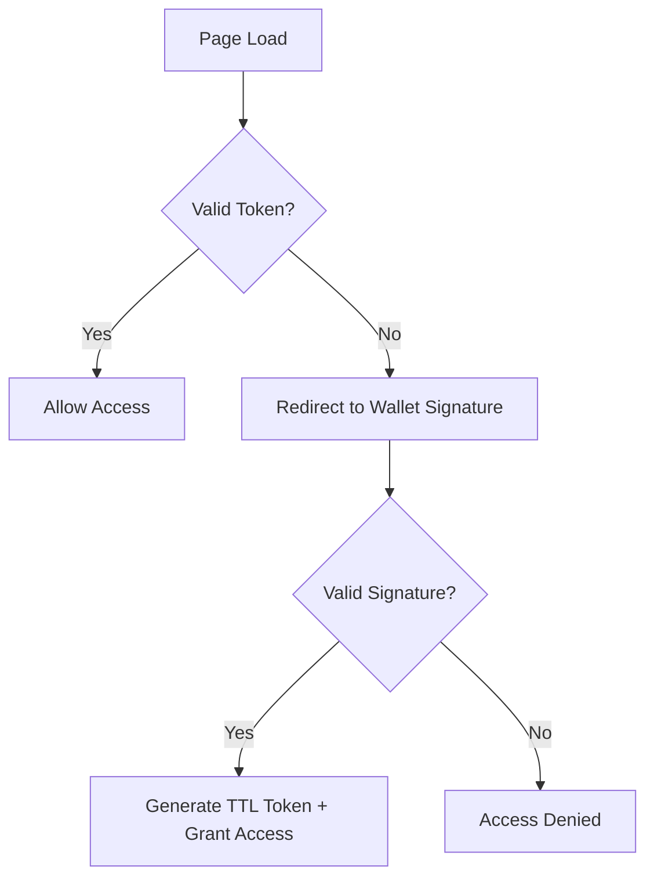

## 🔐 Appendix: ActiveTrust – The EchoMesh Trust Framework

> **Trust, how it’s meant to be.**  
> A protocol for presence, a framework for consent, and a new foundation for access.

---

### 📘 What is ActiveTrust?

ActiveTrust is a lightweight, self-sovereign protocol for **signing intent**, **verifying consent**, and **enabling access** based on real-world alignment—not static roles.

Where other systems ask:  
> *“Who are you?”*  
ActiveTrust asks:  
> *“How did you show up?”*

---

### 🧠 Core Principles

| Principle             | Description                                                                 |
|-----------------------|-----------------------------------------------------------------------------|
| **Sovereignty First** | You own your access. You decide your exposure.                              |
| **Proof > Profile**   | What you prove in presence matters more than what your profile says.        |
| **Coherence > Control** | Access emerges through alignment—not hierarchy.                          |

---

### 🧬 Protocol Flow

### 📦 Trust Stack

ActiveTrust is designed to layer seamlessly into the EchoMesh and Dust5D architecture:

#### 1. Dust5D – Temporal Graph Inference

Trust flows like time. ActiveTrust anchors interactions in Dust5D's time-aware graph structure.

#### 2. Banano Wallet MFA

Presence is proven by signature.

* Wallet = node identity
* Signed message = consent handshake
* Transaction = trust expression

#### 3. Dynamic Identity Graphs

Roles emerge from interaction frequency, mutual co-signs, and peer-trust lineage.

#### 4. Relational Trust Fabric

Trust is mapped as a **living lattice** — node-to-node interactions become signed graph edges.

---

### 🛠️ Use Cases

* Co-sign simulation sessions
* Grant file access based on proximity + intent
* Create revocable trust paths with TTL
* Auto-grant permissions based on DAG interactions
* Consent-based UX: from settings to secrets

---

### 🔁 Trust Model: Co-Sign or Bounce

| Model                | Premise                  | Mechanism                    | Outcome                | Trust Type            |
| -------------------- | ------------------------ | ---------------------------- | ---------------------- | --------------------- |
| **Allow / Deny**     | Authority grants access  | Static policy enforcement    | Binary: Yes or No      | Imposed / Static      |
| **Co-Sign / Bounce** | Alignment enables access | Mutual cryptographic consent | Mutual: Aligned or Not | Emergent / Contextual |

> You don’t pass a gate.
> You **form an agreement** in the moment.

---

### 🌉 Enterprise Extension

ActiveTrust bridges into existing access layers:

* Azure AD, Okta, IAM via wallet relay hooks
* RBAC → Contextual ACL overlay
* Consent-signed session traces
* AccessGraph™ modules for verifiable trail mapping

---

### 🔮 Coming Soon

* Wallet co-sign UI
* Ribbon-based TTL tracing in Dust5D
* CANP-signed assets with embedded trust meta
* Full AccessGraph visualisation module

---

> *“You don’t need to ask permission from systems you’ve outgrown.”*
> — **Callum Maystone**

---
